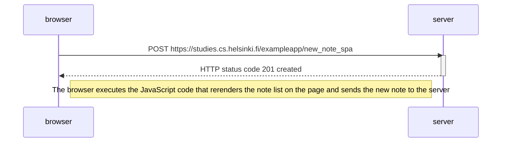

```mermaid
sequenceDiagram
participant browser
participant server

    browser->>server: POST https://studies.cs.helsinki.fi/exampleapp/new_note_spa
    activate server
    server-->>browser: HTTP status code 201 created
    deactivate server

    Note right of browser: The browser executes the JavaScript code that rerenders the note list on the page and sends the new note to the server

```
